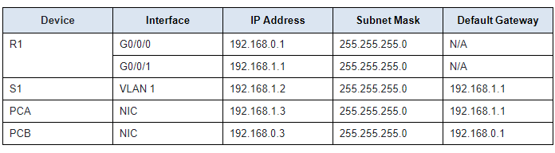

# 📶 Network Simulation Lab with Cisco Packet Tracer

## 📜 Project Overview
This project demonstrates a basic network simulation using **Cisco Packet Tracer**. It includes:
- **1 Router**
- **2 Switches**
- **4 PCs (End devices)**
- Basic configurations such as IP addressing, VLAN setup, and connectivity testing.

## 💻 Network Topology
  [PC1] ---- [Switch1] ---- [Router] ---- [Switch2] ---- [PC2]
  [PC3] ----/                     \\---- [PC4]

## 📥 Files
- **network_simulation.pkt** - Cisco Packet Tracer File
- **README.md** - Project Documentation

## 📊 IP Addressing

## 🚀 Outcome
✅ Successfully configured a network with basic routing and connectivity.  
✅ Tested communication between devices on different networks.  

